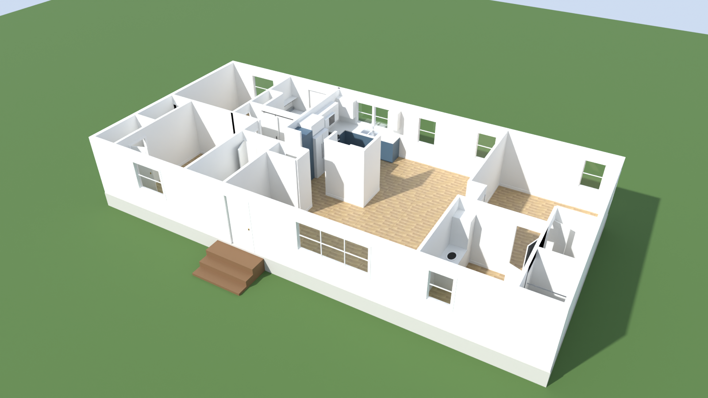

# House Painter

A 3D paint planner for a remodelled 1998 Fleetwood **Waterford Park 4563C** double-wide (56' × 26'-8", 3 bed / 2 bath). The page lets you pick real Sherwin-Williams and Behr colours for every wall, ceiling, cabinet door, interior door and trim piece, see them in 3D under different light, and walk through the house to repaint it like a game.



## What's here

| File | What it is |
|---|---|
| `house-data.js` | **The single source of truth.** Walls, doors, windows, fixtures, cabinets and flooring, in feet. Everything else reads it. |
| `rooms.js` | Room zones and the 90 paintable wall surfaces (one per wall face per room), with areas. |
| `floorplan.html` | 2D floor plan: after / before / changes views, Desert Sand LVP flooring, and the paint-surface map. |
| `paint.html` + `paint-app.js` + `house3d.js` | The 3D paint studio and walkthrough (Three.js r128). |
| `paint-colors.js` | Colour books: 1,526 Sherwin-Williams and 5,443 Behr colours (code, name, hex). |
| `build_house.py` | Builds a Blender model (`house_base.blend`) and renders from the same data. |
| `data/schemes/*.json` | Seven mid-century / Art Deco schemes covering the whole house. |
| `data/*.js` | Build helpers: colour-book compiler, CIEDE2000 colour matcher, scheme builders. |
| `textures/desert_sand_plank.png` | Plank texture cropped from a photo of the actual flooring. |

## Running it

Any static file server works:

```bash
python -m http.server 8770
```

Then open:
- `http://localhost:8770/paint.html` for the paint studio
- `http://localhost:8770/paint.html#walk` to go straight into the walkthrough
- `http://localhost:8770/floorplan.html` for the floor plan

Locally, schemes save in your browser. Published as a Claude artifact, they save to the artifact's shared database so everyone with the link sees the same schemes.

## Using the paint studio

- **Pick a surface:** click a wall, ceiling, cabinet, single cabinet door or drawer, door or trim in the model, or use the room list. Shift-click adds more.
- **Pick a colour:** search by name, number (`7029`) or hex (`#D1CBC1` finds the nearest paints). Choose a sheen.
- **Views:** dollhouse, top-down, outside, and face-a-wall (double-click). The field-of-view slider widens the inside views.
- **Lighting:** True colour shows the chip colour exactly on every wall. Daylight, Overcast and Evening (2700K bulbs) show how real light shifts it.
- **Walkthrough:** WASD to move, Shift to run, mouse to look. Point at a surface and click to open the paint panel. The camera stays still while it's open.
- **Paint needed:** square feet and gallons per colour (2 coats at about 350 sq ft per gallon).

Screen colours are the brands' published approximations. Check real chips in your own light before buying.

## Rebuilding

After editing `house-data.js`:

```bash
node export_house_json.js                       # house.json for Blender
node data/ascii_js.js                           # keep scripts ASCII-safe
"C:/Program Files/Blender Foundation/Blender 5.1/blender.exe" -b -P build_house.py -- --render
```

To rebuild the colour books, download them into `data/src/` and compile:

```bash
curl -L -o data/src/sw.json https://raw.githubusercontent.com/jpederson/colornerd/master/json/sherwin-williams.json
curl -L -A "Mozilla/5.0" -o data/src/behr_all.js https://www.behr.com/mainService/services/colornx/all.js
node data/build_colors.js
```

Nearest real paints to any colour, by CIEDE2000:

```bash
node data/match_colors.js "#C35530" "#2A4F43"
```

## Notes

- Geometry is traced from a photo of the 1998 Fleetwood sheet, accurate to about ±0.3 ft. Field-measure before ordering anything.
- Heights are defaults: 8' flat ceiling, 6'8" doors, 3' window sills.
- The renders and `house_base.blend` come from an earlier build. Re-run `build_house.py` to pick up the latest walls and cabinets.
- Colour data: Sherwin-Williams values via [colornerd](https://github.com/jpederson/colornerd); Behr values from behr.com. Paint names and codes belong to their brands.
