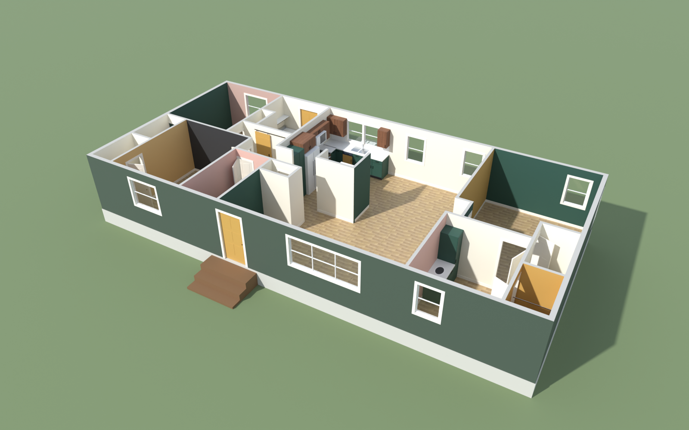
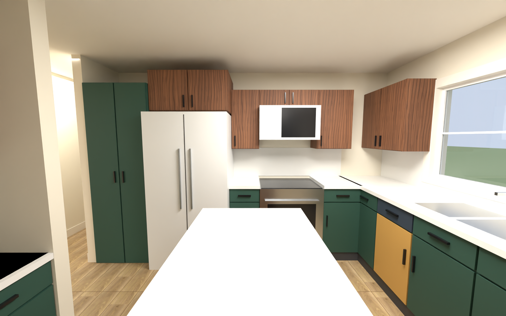

# House Painter

Trace your house from a blueprint, try a colour on every wall, ceiling, cabinet door and trim piece in 3D, walk through the rooms, and render the result in Blender. Free and open source, with no account and no upload: it all runs in your browser.



- **Plan editor.** Upload a photo or PDF of a floor plan, set the scale, then either click the walls yourself or let the editor suggest them (it levels a tilted photo, finds the walls, and you keep the ones that are right). Drop in doors, windows, rooms, cabinets and fixtures.
- **Paint studio.** Every wall face has its own colour. See it in true colour or under daylight, overcast and evening light, share a scheme as a link, and walk through with WASD.
- **Blender.** Export a scheme and the Blender add-on rebuilds the house with the same colours, ready to render.

New here? Read the **[getting-started guide](docs/getting-started.md)**.

## Running it

Any static file server works:

```bash
python -m http.server 8770
```

Then open:

| Address | What |
|---|---|
| `http://localhost:8770/` | The start page |
| `http://localhost:8770/editor.html` | The plan editor: trace your own house |
| `http://localhost:8770/paint.html` | The paint studio, with the example house |
| `http://localhost:8770/paint.html?house=houses/starter-cottage/house.json` | Any house file, by address |
| `http://localhost:8770/paint.html#walk` | Straight into the walkthrough |
| `http://localhost:8770/floorplan.html` | The 2D floor plan (it takes `?house=` too) |

Everything the pages need is in this folder, including the libraries (`vendor/`): the pages make no request to any other site (apart from the Google Fonts, for now). See [Deploying](#deploying) to publish it.

## Your own house

1. Open the plan editor and upload a photo, scan or PDF of your floor plan.
2. Set its scale: click both ends of a dimension you know and type its length.
3. Click corner to corner around the outside walls, then draw the inside walls. Type a length and press Enter for an exact wall.
4. Click doors and windows onto walls, then click inside each space to make it a room and name it.
5. Optional: press `F` and place cabinets, appliances and bath fixtures, and pick the flooring.
6. Press **Paint it**.

Everything stays in your browser until you save `house.json`. **Edit house** in the paint studio brings you back. The full walkthrough, with pictures, is in [docs/getting-started.md](docs/getting-started.md), and every field of the file is in [docs/house-format.md](docs/house-format.md). You can also write the file by hand: copy `houses/starter-cottage/house.json`.

To check a file from the command line:

```bash
node export_house_json.js houses/<your-id>/house.json out.json
```

## Using the paint studio

- **Pick a surface:** click a wall, ceiling, cabinet, single cabinet door or drawer, door or trim in the model, or use the room list. Shift-click adds more.
- **Pick a colour:** search the palette by name, code or hex (`#D1CBC1` finds the nearest colours), and choose a sheen.
- **Wood:** walnut, teak, white oak, red oak, cherry, maple, rosewood or ebonized oak, with tileable grain at real-world scale.
- **Views:** dollhouse, top-down, outside, and face-a-wall (double-click). The field-of-view slider widens the inside views.
- **Lighting:** True colour shows the chip colour exactly on every wall. Daylight, Overcast and Evening (2700K bulbs) show how real light shifts it.
- **Walkthrough:** WASD to move, Shift to run, the mouse to look. Point at a surface and click it to open the paint panel.
- **Share link:** copies a link with the scheme inside it. If the house came from a file, the link carries the house too.
- **Open file…:** opens a house file, or imports a scheme file from **Export for Blender**.
- **Paint needed:** square feet and gallons per colour (2 coats at about 350 sq ft per gallon).
- **Export for Blender:** saves `house-<scheme>.json`, which contains the house, every surface's final colour, wood and sheen, and the camera you're looking at.

Screen colours are approximations. Check real chips in your own light before buying.

## Colours

The studio ships with the **House Painter palette**, 124 original colours (`paint-colors.js`). It is not any paint maker's book, so the project can be redistributed freely. To see a paint maker's colours too, build an extra book from data you download yourself: see [data/README.md](data/README.md). The extra book appears as another tab, and it is never committed to this repository.

Schemes save in your browser. When the page is published as a Claude artifact, they save to the artifact's shared database, so everyone with the link sees the same schemes. To use another backend, implement the small interface at the top of `storage.js`.

## Rendering a scheme in Blender

**With the add-on.** Build it with `python tools/build_addon.py` (or take `house_painter-<version>.zip` from a release). In Blender 4.2 or newer, use **Edit > Preferences > Get Extensions > Install from Disk**. Then **File > Import > House Painter scheme (.json)**. The scene arrives with cameras for your exported view, the dollhouse and every room.

**From the command line.**

```bash
"C:/Program Files/Blender Foundation/Blender 5.1/blender.exe" -b -P build_house.py -- --scheme examples/house-cozy-deco-emerald-brass.json --render
```

| Option | What it does |
|---|---|
| `--scheme FILE` | A file from **Export for Blender**. It contains the house, so nothing else is needed. |
| `--house FILE` | A house to build without a scheme (primer white, cabinets in their default colours). This needs Node.js. The default is the example house. |
| `--views` | `export` (your exported camera), `doll`, `top`, `out`, `rooms` (the house's `renderRooms`), or room ids such as `kitchen,bed1`. The default is export + doll + rooms. |
| `--light` | `day`, `overcast`, `evening` or `true`. The default is the lighting you exported with. |
| `--samples`, `--res` | Cycles samples (default 64) and image size (default `1600x1000`). |
| `--render` | Render the views. Without it, the script only builds and saves the `.blend`. |
| `--keep-scene`, `--no-save` | Build into the open scene, and don't write a `.blend` (what the add-on uses). |

The script writes `house_<scheme>.blend` and `renders/<scheme>/<view>.png`. The Blender build uses the same surface keys, cabinet-door numbering and wood grain as the page, and interior light is calibrated so a wall facing the camera renders close to its chip.



## Deploying

`npm run build` writes the site to `dist/`: just what the pages need, with content-hashed asset names and the headers file. Deploy that folder to any static host. On **Cloudflare Pages**: framework **None**, build command `npm run build`, output directory `dist`, `NODE_VERSION=22`, production branch `main`. The production site is at <https://housepainter.r7orbit.io/> and is embedded in an iframe on r7orbit.io.

`npm run preview` serves `dist/` the way Pages does. The exact settings, the headers, the iframe attributes the app needs (`allow-forms` and `allow-downloads` as well as scripts, same-origin and pointer lock), what it requests, browser needs and a post-deploy checklist are in **[docs/DEPLOY.md](docs/DEPLOY.md)**.

## What's here

| File | What it is |
|---|---|
| `index.html` | The start page. |
| `editor.html` + `editor.js` | The plan editor. |
| `paint.html` + `paint-app.js` + `house3d.js` | The 3D paint studio and walkthrough (Three.js r128, from `vendor/`). |
| `floorplan.html` + `floorplan.js` | The 2D floor plan: after / before / changes views and the paint-surface map. |
| `house-core.js` | The shared pipeline, for browser and Node: wall joinery, room zones, paintable wall surfaces, room shapes, and the Blender export. |
| `house-loader.js` | Picks the house for a page (`?house=…`, an opened file, or the example) and builds it. |
| `tracer.js` | Assisted tracing: levels a tilted blueprint and finds its walls with plain image processing (no AI service). Runs in the browser and in Node. |
| `fixtures.js` | The fixture library and the geometry shared by the editor, studio, walkthrough and Blender: every fixture can face any way. |
| `storage.js` | Where schemes are kept: this browser, or the Claude artifact runtime's shared database. It also makes share links and saves files. |
| `paint-colors.js` | The House Painter palette. |
| `vendor/` | The third-party libraries (three.js, PDF.js, tesseract.js, onnxruntime-web), pinned and with their licences: [vendor/README.md](vendor/README.md). |
| `houses/<id>/house.json` | A house. `waterford-4563c` is the example (with seven schemes in `schemes/`); `starter-cottage` is a small template; `bay-cottage` has angled walls (a cut corner and a bay), `round-cottage` curved ones, `vaulted-cabin` sloped ceilings, a roof and a porch, and `two-storey` two floors with a staircase. |
| `build_house.py` | Builds the Blender model, applies an exported scheme, and renders views. |
| `blender_addon/` | The Blender add-on (File > Import). |
| `export_house_json.js` | Compiles a house file for Blender and checks it for problems. |
| `examples/` | A scheme exported with **Export for Blender**. |
| `data/` | The palette builder and other data tools: [data/README.md](data/README.md). |
| `ui/` | The interface's stylesheets, self-hosted fonts and logo, built on the R7 Orbit design tokens: [docs/DESIGN.md](docs/DESIGN.md). |
| `tests/`, `tools/` | Unit tests; and scripts that build the site (`build.js`), preview it (`preview.js`), test it in an iframe in a browser (`e2e/`) and build the add-on. |
| `404.html`, `_headers` | The not-found page and the Cloudflare Pages headers. |
| `docs/` | The getting-started guide, the house file format, the optional learned model, [deploying](docs/DEPLOY.md) and the interface design notes ([DESIGN.md](docs/DESIGN.md)). |

## Developing

```bash
npm test                         # unit tests: core, fixtures, palette, schemes, pages, the production build
npm run build                    # the deployable site, in dist/ (see Deploying)
blender -b --factory-startup -P tools/test_addon.py   # add-on, end to end
node data/ascii_js.js            # keep page scripts ASCII-safe after editing them
```

See [CONTRIBUTING.md](CONTRIBUTING.md) and the [roadmap](ROADMAP.md).

## Notes

- The example house's geometry is traced from a photo of the 1998 Fleetwood sheet and is accurate to about ±0.3 ft. Field-measure before ordering anything.
- Licensed under the [MIT licence](LICENSE). Third-party notices are in [NOTICE.md](NOTICE.md).
