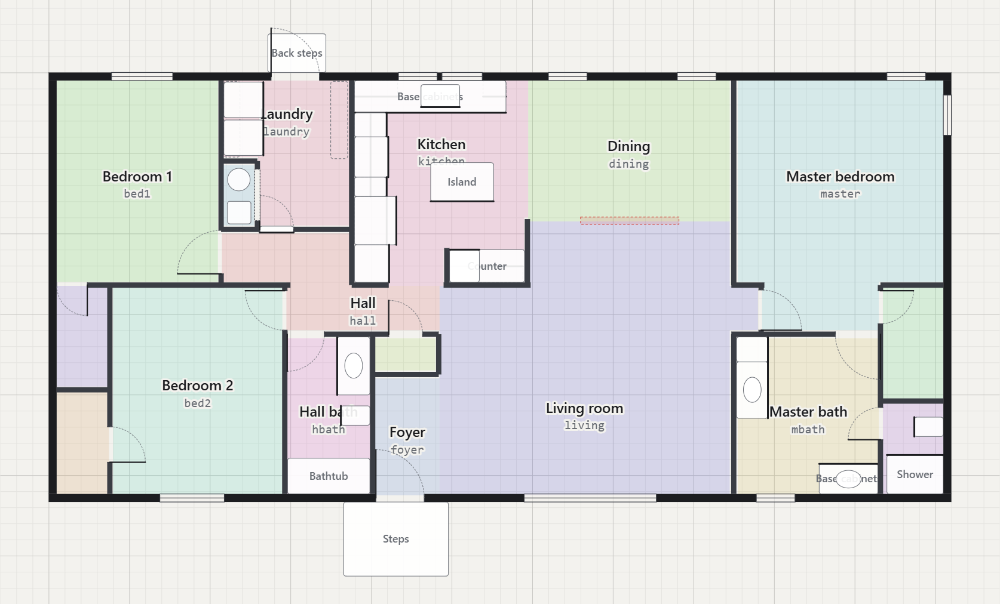
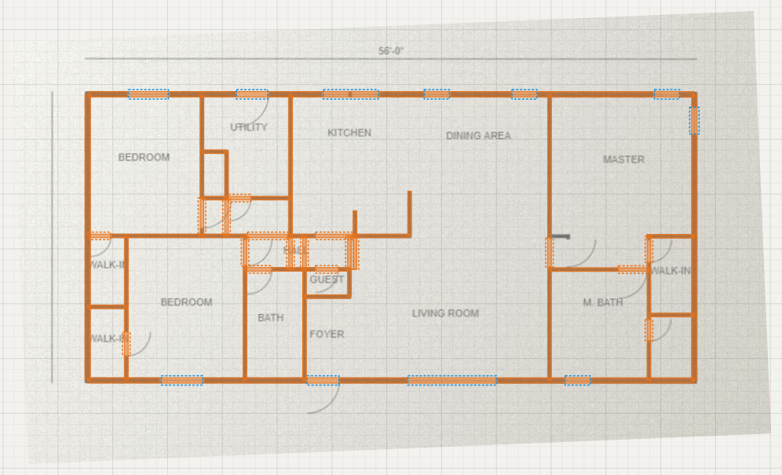
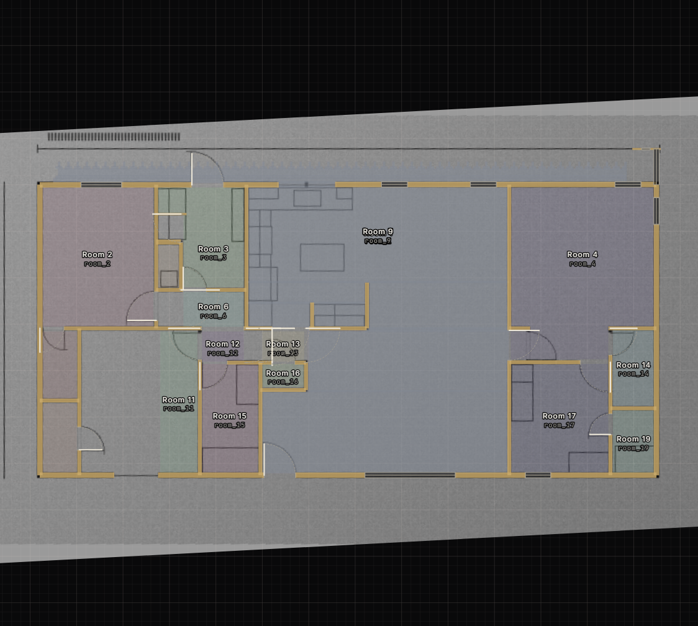
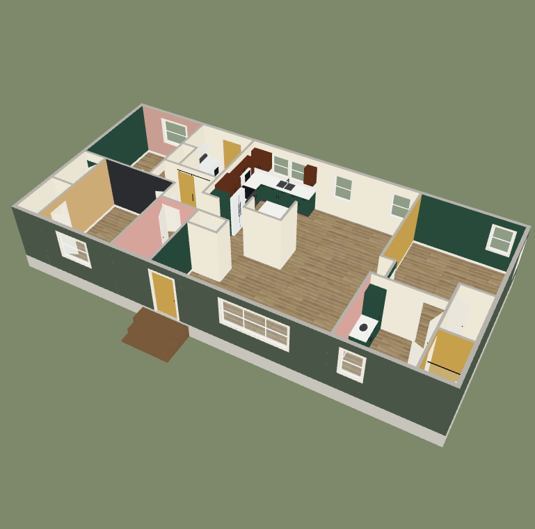
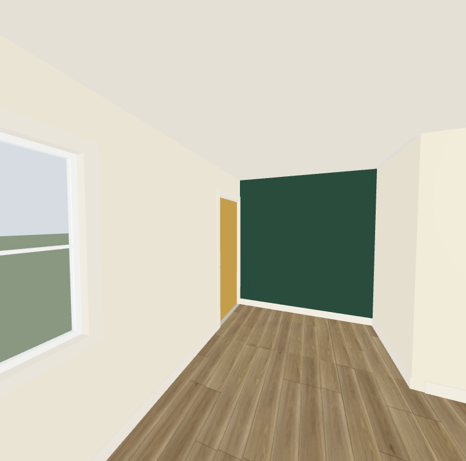

# Getting started

From a floor plan on paper to a painted, rendered house. It takes about 15 minutes to trace a typical house, and nothing needs installing: it all runs in your browser. You don't need an account, and nothing is uploaded anywhere.



## 1. Open the tools

- **On the web:** open the project's page and press **Trace your house**. (The address is in the repository's About box.)
- **On your own computer:** download or clone the repository, then in its folder run

  ```bash
  python -m http.server 8770
  ```

  and open `http://localhost:8770/`. The pages need to be served this way, because a browser won't let a page opened straight from disk read other files.

Try the **example house** in the paint studio first if you'd like to see where this is going.

## 2. Trace your house (about 15 minutes)

Open the **plan editor**. The steps down the left side follow this order, and tick themselves off as you go.

**Get a blueprint.** Any picture of the floor plan works: a phone photo of the paper plan, a scan, or a PDF from the builder. A straight-on photo is best. It doesn't have to be perfect. You can straighten a skewed one with the **Rotate** slider afterwards. If you have no plan at all, press **Draw from measurements** and type the lengths of your walls instead.

**Tip: let the editor do the tracing.** After step 2 you can press **Suggest walls…** (or `A`), and the editor draws a first pass for you: see [Let the editor suggest the walls](#let-the-editor-suggest-the-walls) below. You then keep the steps from 3 to 6 for checking and fixing what it found.

**1. Upload it.** Press **Upload a blueprint** and choose the file. For a PDF with several pages, pick the page that has the floor plan. The image appears under the grid and fades with the **Opacity** slider. Use **Move** to drag it into a comfortable place.

**2. Set the scale.** Click two points on the blueprint whose real distance you know, like the two ends of the overall width, then type it: `56'`, `26'8"`, or `12.5` for feet. Pick the longest dimension you can find, because small errors in the points matter less over a long distance. You can set the scale again at any time.

**Or let it read the dimensions.** If the plan has dimension lines with their numbers (`40'-0"`), press **Read dimensions…** in the Blueprint box. The first time, it asks to load a free text-reading tool (tesseract.js, about 7 MB, from the same site as the page); your picture is read on your own computer and never uploaded. It matches each number it can read to the dimension line beside it, shows you what it found, and sets the scale when you agree. It works best on a straightened picture with clear lettering. If it can't find enough, it says so and you click two points as above.

#### Let the editor suggest the walls



This is optional, and it works on the picture only: nothing is sent anywhere, and no AI service is involved. It finds the long, straight, solid bars that walls are made of, and ignores text, dimension lines, door swings and furniture.

1. In the **Blueprint** box on the left, press **Straighten**. The editor measures how tilted the picture is and levels it (you can still fine-tune with the Rotate slider).
2. Make sure the scale is set, then press **Suggest walls…** and **Find walls**. It takes a second or two.
3. Suggested walls appear in orange, with gaps in them marked as doors (orange) and windows (blue). **Click a wall to leave it out**, and click it again to bring it back.
4. If it picked up too much or too little, change the settings and press **Find again**:
   - *How the walls are drawn*: **Solid** (filled in, the usual case), **Outlined** (two thin lines) or **Thin** (a single line, the least reliable).
   - *Shortest wall*: lower it to catch short stubs.
   - *Sensitivity*: raise it for a faint photo, lower it when it picks up too much.
5. Press **Add N walls**. Your existing walls are never touched, and walls you've already drawn aren't added twice.
6. Press **Find all rooms** in the Rooms list: every closed space becomes a room, ready to name.



It also looks for walls at an angle (a cut corner, a diagonal wall), and tells doors from windows by the swing arcs and window lines in the gaps, when the picture draws them. You can turn either off in the panel.

If the picture is hand-drawn or otherwise unusual, an optional learned model can find the walls instead: [docs/learned-model.md](learned-model.md).

It is a helper, not a finished tracer. Expect to fix a few things: short walls beside doors can be missed, the gaps are only *guesses* at doors and windows (an outside gap is called a window, so change your front and back doors), and rooms with a missing wall run together until you add it. On a test set made from the two example houses (with noise, shading, blur and tilt added) it finds roughly 90% of the wall area, and about 90% of what it draws is real wall.

**3. Outside walls.** Press `W` (Wall) with **Outside wall** selected and click each corner of the house in turn.
- Walls lock to horizontal or vertical, and end on the corners of other walls.
- **Angled walls** (a cut corner, a bay window): switch on **Angled** in the toolbar, or hold `Shift` while you click. These walls snap to every 15°, to the ends of other walls, and to the place where they cross one. Type a length for an exact wall. The **Angled** button works for inside walls too, and doors and windows go in an angled wall like any other. Cabinets and appliances you put against one turn to sit square to it.
- For an exact wall, type its length (like `12'6`) and press `Enter` instead of clicking.
- Clicking back on the first corner closes the loop, and the tool switches to inside walls.
- Hold `Alt` to turn snapping off.
- **Curved walls:** switch on **Curved**, click the two ends, then move the pointer to bend the wall and click. Drag the dot in the middle of a selected curve to change the bend, or type it in the panel on the right.

Trace along the **centre line** of each wall. The editor gives walls their thickness.

**4. Inside walls.** Draw each wall from one end to the other. Their ends snap to the walls they meet, and a joint with another wall is cleaned up for you.

**Roof, siding and porch.** With nothing selected, the **Roof and siding** section at the bottom of the panel on the right sets a roof (gable, hip, shed or flat, with its pitch and overhang) and a siding profile. A porch is in the Fixture list under **Outside**: put it with its back against the wall. The roof shows in the Paint Studio's **Outside** view, where it can be painted too.

**More than one floor.** In the **Floors** list on the left, press **Add a floor above**: the outside walls are copied to start you off, and the floor below shows faintly underneath. Draw its walls, doors, windows and rooms the same way. For stairs, put **Straight stairs** on the lower floor (the Fixture tool), then use **Stairwell** (`U`) on the floor above to cut the hole they come up through.

**5. Doors, windows and openings.** Press `D` (door), `N` (window) or `O` (a doorway with no door) and click on a wall. Then:
- Drag a door's ends to size it, or drag its middle to slide it along the wall.
- In the panel on the right, set which side the hinge is on and which way it swings.
- Windows take a sill height, a head height and the number of panes. Anything you leave empty uses the house defaults.

**6. Rooms.** Press `R` (Room) and click inside each enclosed space, then name it. The editor fills the space and stops at doorways. For an open-plan area, like a kitchen that runs into a dining room, press `L` (Split) first and draw a line where one room should end and the next begin, and then click each side with the Room tool.

Each room gets a short **wall ID prefix** (the kitchen's is `KIT`). Walls are named from it, like `KIT-N` for the kitchen's north wall, and your saved paint colours refer to those names. Choose it before you start painting.

**7. Fixtures (optional).** Press `F` and pick cabinets, appliances, a toilet, a tub or a shower, then click where it goes. It backs onto the wall nearest your cursor and faces into the room. `T` turns one that stands free. Every cabinet door and drawer can be painted on its own in the studio.

**8. Heights and floor.** Click empty space to see the house settings on the right: ceiling, door and window heights, and the flooring (a plain colour, a wood, or a photo of your own floor).

**9. Check your work.** Turn on **3D preview** to see the house build as you draw. The bar at the bottom says how many things are left to fix before the house can be painted.

**Save.** Press **Save house.json**. It's an ordinary text file, so keep it somewhere safe (or in git), and open it again later with **Open…**. The editor also keeps an autosave in your browser.

## 3. Paint it

Press **Paint it**. The same house opens in the **paint studio**.



- **Click a wall** (or a ceiling, a door, trim, a cabinet) to pick it, **Shift-click** to pick several, then click a colour. **Double-click** a wall to face it.
- Every wall face has its own colour, so one wall in a room can differ from the others. The **Paint needed** list works out gallons per colour for you.
- **Lighting** (True colour, Daylight, Overcast and Evening) shows how a colour shifts as the light changes.
- **Schemes:** **New**, **Duplicate** and **Rename** keep several looks side by side. They save in your browser, separately for each house.
- **Share link** copies a link that opens your scheme for anyone (with your house inside it, if you made it in the editor).
- **Open file…** imports a scheme file, or opens a different house.

### Walk through it



Press **Walkthrough**. Move with `W` `A` `S` `D`, look with the mouse, and run with `Shift`. Point at any surface and click: the colour picker opens on the right while the camera stays where it is, so you can judge the colour in the room it will live in. `Esc` frees the mouse.

## 4. Render it in Blender

Blender gives you realistic lighting and reflections. This step is optional and needs [Blender](https://www.blender.org/) 4.2 or newer.

**Save a scheme for Blender.** In the studio, point the camera at the view you'd like, then press **Export for Blender**. The file holds the house, every surface's colour, and the camera you are looking through.

**With the add-on (easiest).** Download `house_painter-<version>.zip` from the project's Releases page. In Blender: **Edit > Preferences > Get Extensions**, open the menu at the top right, choose **Install from Disk**, and select the zip. Then **File > Import > House Painter scheme (.json)** and choose your exported file. The scene arrives with cameras for the exported view, the dollhouse and every room (look for `Cam_` in the outliner). Pick one as the active camera and press `F12`.

**From the command line.**

```bash
blender -b -P build_house.py -- --scheme my-scheme.json --render
```

This writes `renders/<scheme-name>/*.png` next to the script. See the options in the main [README](../README.md#rendering-a-scheme-in-blender).

Every wall, ceiling, door and cabinet door arrives as its own material, named `Paint:<ID>` (like `Paint:KIT-N`), so you can fine-tune any of them by hand.

## If something goes wrong

| What you see | What to do |
|---|---|
| "This space isn't closed: it leaks outside the house" | Two walls don't quite meet. Zoom in on the corners (or turn on 3D preview) and drag the loose end onto the other wall. |
| "That space is already a room" | Click it with the Select tool to change that room, or delete the room first. |
| Colours disappeared after I edited the walls | Painted colours belong to wall names like `BR1-N`. Moving a wall so that it splits into two surfaces, or renaming a room's prefix, gives those walls new names. Edit the plan first and paint afterwards. |
| The page is blank, or says it can't load the house | Serve the folder with `python -m http.server`. Pages opened with `file://` can't read other files. |
| The blueprint is gone after I reopened the editor | The image lives in your browser, not in `house.json`. Upload it again: its scale and position are remembered. |
| Importing a plain `house.json` into Blender fails | That needs [Node.js](https://nodejs.org/) to be installed. A scheme exported from the studio carries the house and doesn't. |
| My PDF doesn't load | The PDF reader loads the first time you open a PDF, so the page has to be served (not opened from `file://`). Or save the page as an image and upload that. |

If you're stuck, [open an issue](https://github.com/EOSHunter/house-painter/issues) and attach your `house.json`.

## Going further

- [House file format](house-format.md): every field of `house.json`, to write or edit a house by hand.
- [Roadmap](../ROADMAP.md): what is planned.
- [Contributing](../CONTRIBUTING.md): how to run the tests and send a change.
